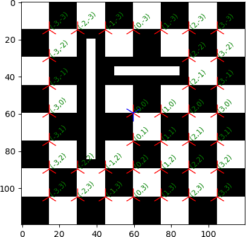

# DetLocLCheck -- Detection, Localization, Checkerboard, L marker

## intro

`DetLocLCheck` is a software tool designed for the Detection and Localization
of Checkerboard calibration targets containing L-shape markers.
This tool utilizes template matching for initial detection,
followed by refinement using OpenCV's
[`cornerSubPix`](https://docs.opencv.org/4.x/dd/d1a/group__imgproc__feature.html#ga354e0d7c86d0d9da75de9b9701a9a87e)
function to achieve subpixel accuracy.
Finally, world coordinates are assigned to the detected markers.


## install

Before installing `DetLocLCheck`, ensure that the required dependencies
are met:

We need at least the following Debian packages:

* `python3-numpy` ([numpy.org](https://numpy.org/))
* `python3-opencv` ([opencv.org](https://opencv.org))
* `python3-pip` ([pip.pypa.io](https://pip.pypa.io/))

Important: On Ubuntu 22.04, do not install `python3-hatchling` and
`python3-pathspec` as they are too old.

Note that `numpy` is defined as a dependency in `pyproject.toml`, but we
strongly recommend using the package from your operating system's package
management system.

Similarly, `opencv-python` is not defined as a dependency in `pyproject.toml`.
The reason is that `pip` ignores the package from the package management
system from the operating system. As before we strongly recommend to use
the package from the package management system of your operating system.

If you still want to install `opencv-python` using pip, use the following
command (not recommended!):

```sh
pip3 install opencv-python
```

The recommended way to install `DetLocLCheck` is:

```sh
pip3 install --break-system-packages --user https://gitlab.com/ug-cp/detloclcheck/-/archive/0.1.2/detloclcheck-0.1.2.zip
```

On Ubuntu 22.04 the new flag `--break-system-packages` is not available and
you should do:

```sh
pip3 install --user https://gitlab.com/ug-cp/detloclcheck/-/archive/0.1.2/detloclcheck-0.1.2.zip
```

For development you could install an editable version, e. g.:

```sh
pip3 install --break-system-packages -e https://gitlab.com/ug-cp/detloclcheck/-/archive/0.1.2/detloclcheck-0.1.2.zip
```

This method only works with Python 3.10 and later.

If you really want to use the latest packages via `pip` you can do:

```sh
python3 -m venv --upgrade-deps "$HOME"/.venv_DetLocLCheck
. "$HOME"/.venv_DetLocLCheck/bin/activate
pip3 install --user "DetLocLCheck[opencv-python] @ git+https://gitlab.com/ug-cp/detloclcheck.git"
```

Or for the headless version of opencv:

```sh
pip3 install --user "DetLocLCheck[opencv-python-headless] @ git+https://gitlab.com/ug-cp/detloclcheck.git"
```

## Example

Here are some examples of using `DetLocLCheck`:

Find and detect checkerboards in multiple images and handle the images in parallel:

```sh
detloclcheck find_checkerboard -log_file cam.log -run_parallel \
    -crosssizes 35 55 -min_sharpness 25 50 100 -f *.png
```

Create example data, do the detection, and visualize the result:

```sh
detloclcheck create_checkerboard_image -outfile foo.png -size 23
detloclcheck find_checkerboard -f foo.png
detloclcheck visualize foo.json -i foo.png
```



You can also use the Python module `detloclcheck` instead of the
command-line interface:

```py
import cv2

import matplotlib.pyplot

from detloclcheck.detect_localize_checkerboard import \
    detect_localize_checkerboard

image_name = 'foo.png'
gray_image = cv2.imread(image_name, cv2.COLOR_BGR2GRAY)
coordinate_system, zeropoint, axis1, axis2 = \
    detect_localize_checkerboard(
        gray_image, (11, 23),
        (0.0,  22.5,  45.0,  67.5,  90.0, 112.5, 135.0, 157.5))
matplotlib.pyplot.imshow(gray_image, cmap="Greys")
matplotlib.pyplot.plot(
    coordinate_system[:, 0, 0], coordinate_system[:, 0, 1],
    'r2', markersize=20)
matplotlib.pyplot.plot(zeropoint[0], zeropoint[1], 'b1', markersize=20)
for i in range(coordinate_system.shape[0]):
    matplotlib.pyplot.text(
        coordinate_system[i, 0, 0], coordinate_system[i, 0, 1],
        f'({int(coordinate_system[i, 1, 0])},'
        f'{int(coordinate_system[i, 1, 1])})',
        color='g', fontsize='small', rotation=45)
matplotlib.pyplot.show()
```

## Citation

If you are using detloclcheck, please make it clear by citing:

Mohr, D. (2025). DetLocLCheck. Zenodo. https://doi.org/10.5281/zenodo.15002509

If you are using a specific version, please use the corresponding DOI.

## copyright + license

Author: Daniel Mohr.

Date: 2025-07-16 (last change).

License: LGPL-3.0-or-later

Copyright (C) 2024-2025 Daniel Mohr
